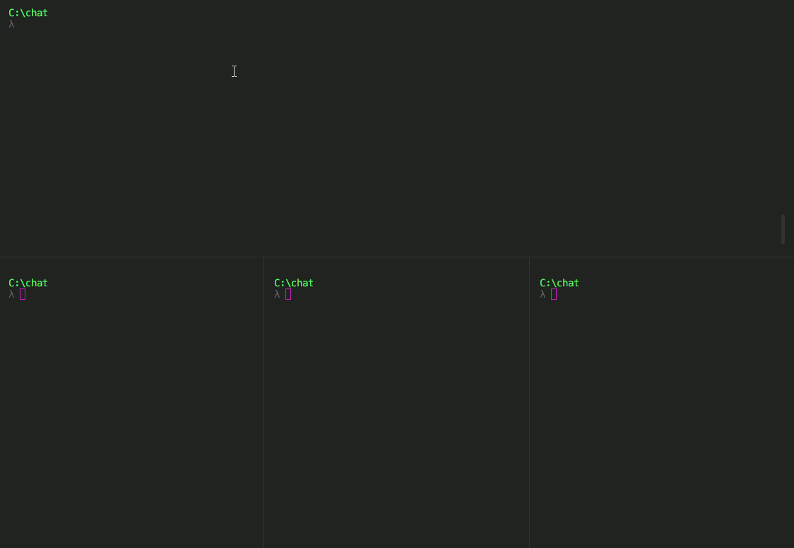

Clone the repo, then restore and run using:
```
dotnet run
```
This piece of software was written in a haste and lacks any errorhandling or automated tests, that you'd normally find in a production-level repository.

